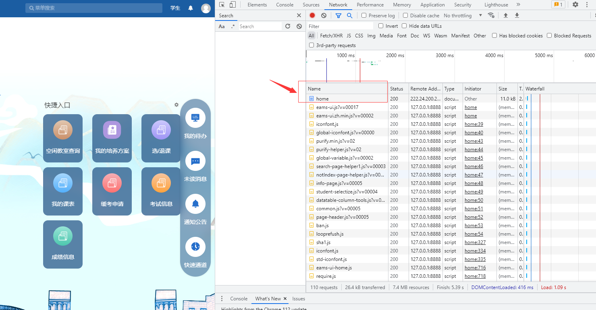
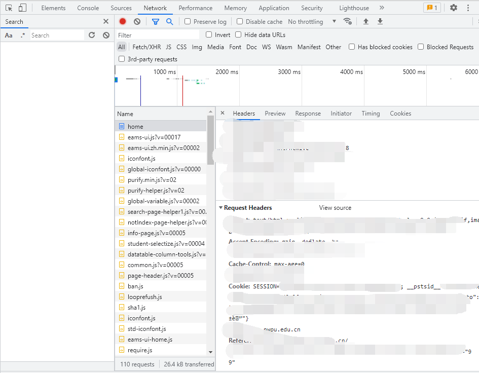
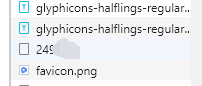
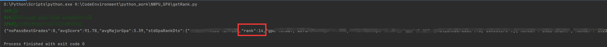

操作流程：
-   打开翱翔门户的翱翔教务，然后点击F12（如果什么都没有，点击F5刷新）：
-   然后点击home，找到**Request Headers**中的**cookie**，复制*SESSION*和*__pstsid*的值
-   然后点击**成绩信息**，检查方框底部会出现自己的*studentAssoc*：

运行程序，输入：

```
studentAssoc
SESSION
__pstsid
```

就能查看自己的GPA排名：